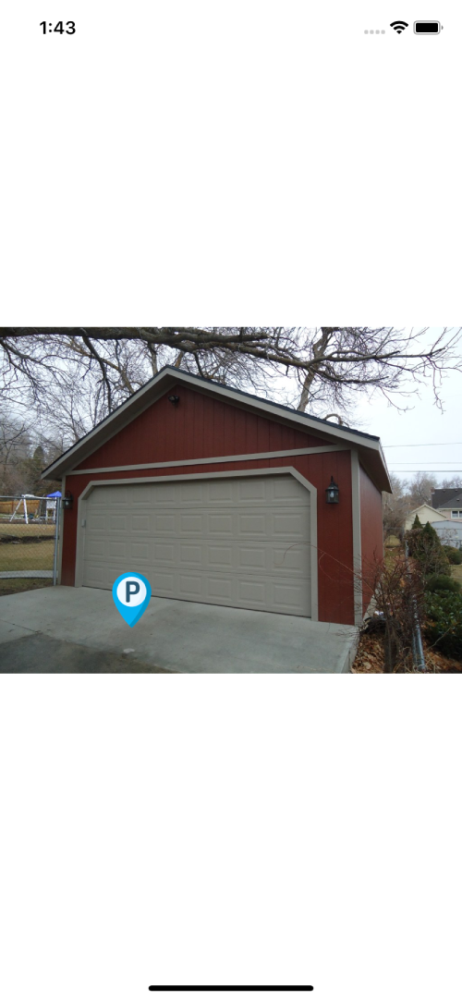

# react-native-image-marker

> Merge image and marker into one!

## HOW TO INSTALL ?

```javascript
npm i --save react-native-image-marker
```

## HOW TO USE ?

```javascript
import ImageMarker from "react-native-image-marker";

function MyComponent() {
	return (
		<View>
			<ImageMarker
				image={require("./assets/garage.jpeg")}
				markerImage={require("./assets/marker.png")}
				markerSize={50}
				onChange={data => console.log(data)}
			/>
		</View>
	);
}
```

### Result



## Reference

## Props

### `image`

The image source (either a remote URL or a local file resource).

| Type | Required |
| ---- | -------- |
| ImageSourcePropType | Yes       |

---

### `markerImage`

The marker image source (either a remote URL or a local file resource).

| Type | Required |
| ---- | -------- |
| ImageSourcePropType | Yes       |

---

### `markerSize`

The marker image size.

| Type | Required |
| ---- | -------- |
| number | Yes       |

---

### `onChange`

Invoked when the marker position changed.

| Type | Required |
| ---- | -------- |
| function | Yes       |

## LICENSE

MIT
